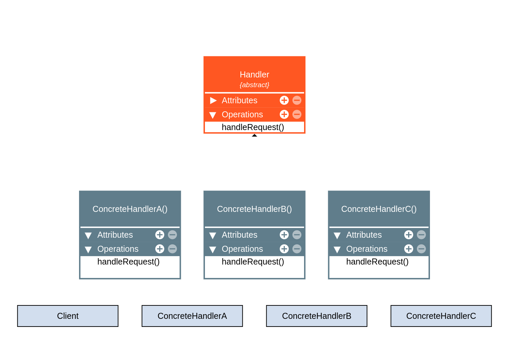

 

# Chain of Responsibility Pattern - Behavioral Pattern

Project is example use chain of responsibility pattern describe work, objective is learn.

## About Chain of Responsability Pattern

From Wikipedia, the free encyclopedia

In object-oriented design, the chain-of-responsibility pattern is a behavioral design pattern consisting of a source of command objects and a series of processing objects.
Each processing object contains logic that defines the types of command objects that it can handle; the rest are passed to the next processing object in the chain.
A mechanism also exists for adding new processing objects to the end of this chain.

In a variation of the standard chain-of-responsibility model, some handlers may act as dispatchers, capable of sending commands out in a variety of directions, forming a tree of responsibility. 
In some cases, this can occur recursively, with processing objects calling higher-up processing objects with commands that attempt to solve some smaller part of the problem;
in this case recursion continues until the command is processed, or the entire tree has been explored. An XML interpreter might work in this manner.

This pattern promotes the idea of loose coupling.

The chain-of-responsibility pattern is structurally nearly identical to the decorator pattern, the difference being that for the decorator,
all classes handle the request, while for the chain of responsibility, exactly one of the classes in the chain handles the request.
This is a strict definition of the Responsibility concept in the GoF book. However, many implementations
(such as loggers below, or UI event handling, or servlet filters in Java, etc) 
allow several elements in the chain to take responsibility.

## Overview
From Wikipedia, the free encyclopedia

The Chain of Responsibility [2] design pattern is one of the twenty-three well-known GoF design patterns that describe common solutions to recurring design problems when
designing flexible and reusable object-oriented software, that is, objects that are easier to implement, change, test, and reuse.

## Diagram Structure

